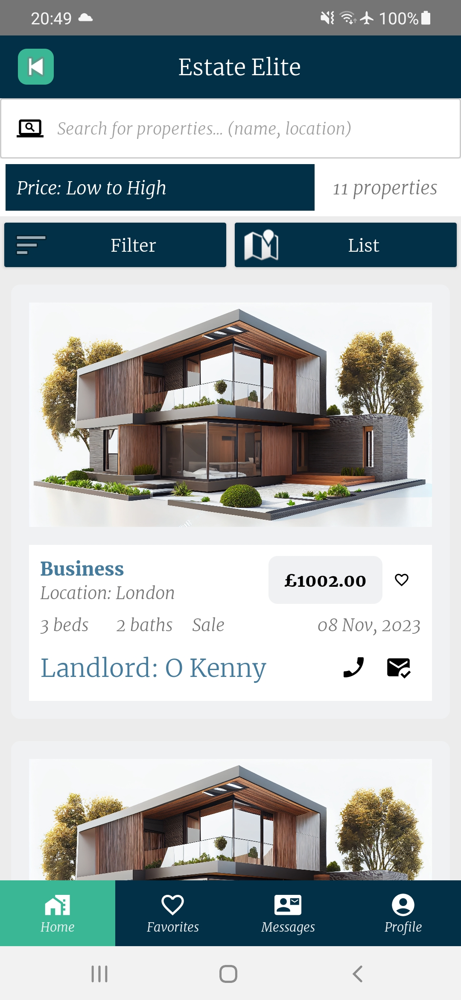
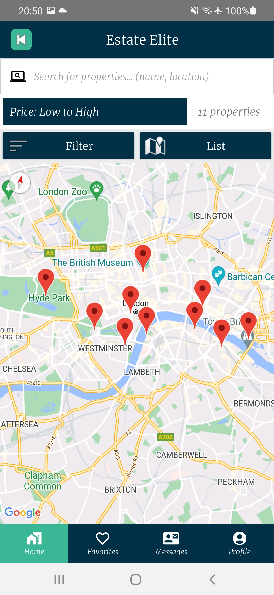
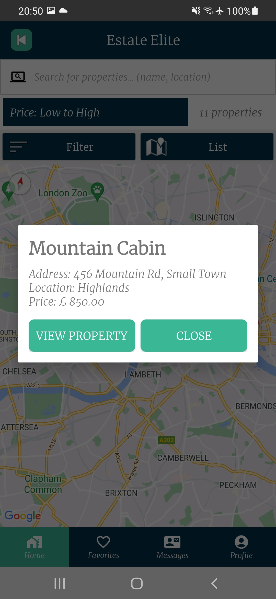
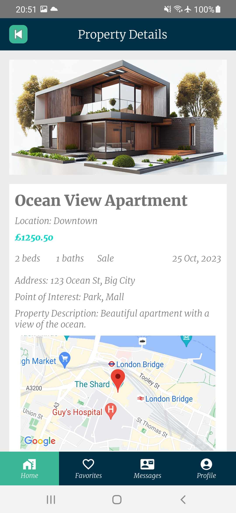
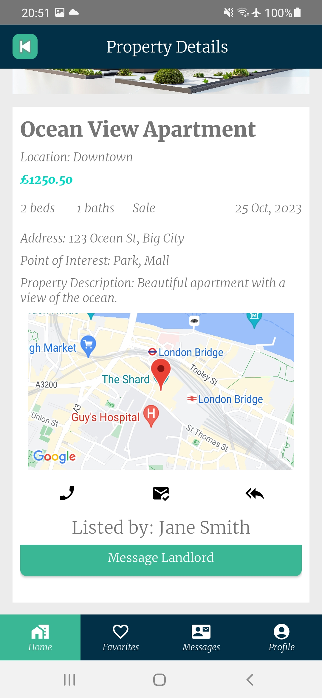
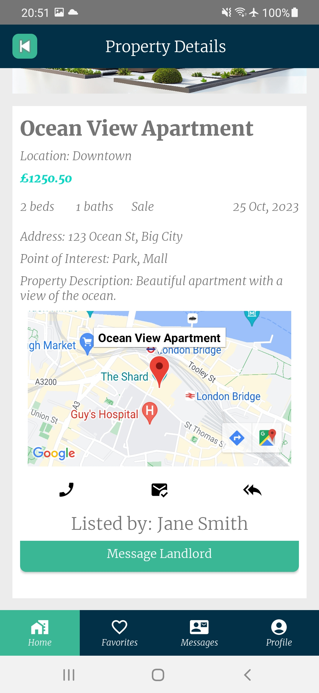

### Estate Elite - Real Estate Mobile App

Estate Elite is a mobile application for real estate agents to manage their properties and tenant
inquires.
The application is built Kotlin and PHP Backend. The application is currently only available for
Android devices.

## Features

- [x] Login and Registration
- [x] Add, Edit, Delete Properties
- [x] Manage Inquiries
- [x] Manage Users, Landlords

## Requirements to run the application

- Android Studio
- PHP Server (XAMPP)

## Installation

### Change the API URL in the config file - src/main/res/values/config.xml

```xml

<string name="base_api_url">
    http://192.168.0.144/landlord/api
</string>
```

### PHP Backend Setup - XAMPP should be running

- Copy the backend folder to the htdocs folder in XAMPP
- Create a database named landlord
- Import the landlord.sql file to the database

### Screenshots





